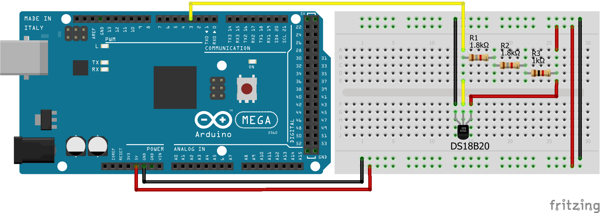

# Sensor_Temperatura_DS18B20

Projeto realizado para equipe Vento Sul (UFSC). 

**1. Configuração do Hardware**

Componentes:
* Arduino MEGA ([Datasheet](http://ww1.microchip.com/downloads/en/DeviceDoc/Atmel-2549-8-bit-AVR-Microcontroller-ATmega640-1280-1281-2560-2561_datasheet.pdf))
* DS18B20 ([Datasheet](https://datasheets.maximintegrated.com/en/ds/DS18B20.pdf))
* 2 resistores 1.8 kΩ
* 1 resistor 1 kΩ
* protoboard
* jumpers

**2. Configurações dos Software**

Bibliotecas do Arduino:
* DallasTemperature ([Download](https://www.arduinolibraries.info/libraries/dallas-temperature))
* OneWire ([Download](https://www.arduinolibraries.info/libraries/one-wire))
